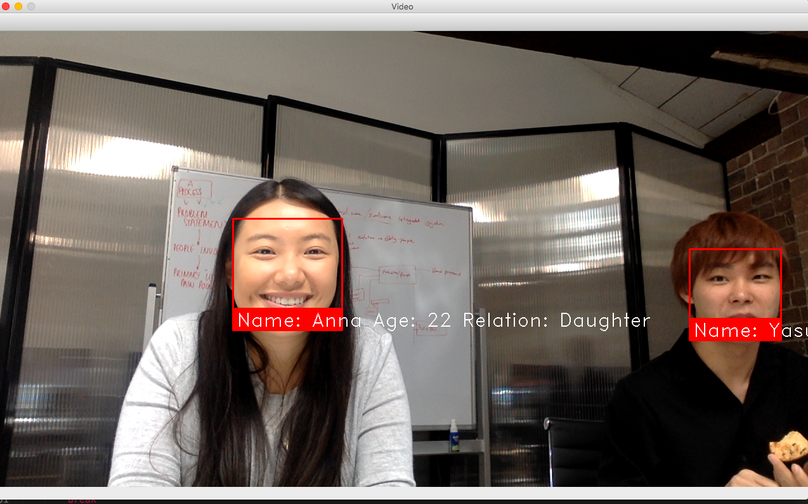
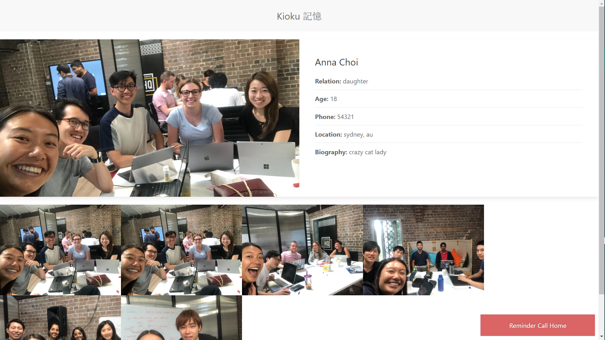

# Kioku
Software that helps alleviate the many stresses of Dementia and Memory Loss patients.

Kioku is the Japanese word for Memory and this project was the result of Medical Device Hackathon 2019 hosted by Innovation Dojo. This project aims at using face detection technology to help elderly patients suffering from dementia to identify their relatives and friends.

A Python script is used to detect faces and the dementia patients can see more information about the person which is displayed on a web browser. The following images show the process of face detection. This technology can further be incorporated into wearable devices such as a smart goggles to help elderly patients see details about the person they view.



Once these person in the image is identified, a set of information is displayed on a web browser. This functionality is based on using HTML/CSS and JavaScript. The following image shows this feature.



## Method of using
Create a server by using `server.js`. Depending upon the server, make changes in the python file. In the python script `json_call.py` change the name of the server in the following line of code.

```	handler = urllib.request.urlopen('http://192.168.88.232:3000/url', data)```

To perform face recognition operation, make sure you have OpenCV python library and download [face_recognition](https://github.com/ageitgey/face_recognition) library.
